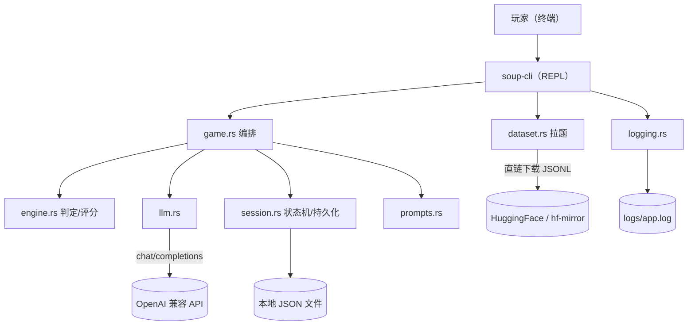

# 02 · 技术架构

> 本章回答"用什么搭、怎么分层、接口长什么样"。定位、玩法见 [01 游戏设计](01-游戏设计.md)。
> **v3.0 重大变更：项目只做 CLI，移除 Tauri/Vue 桌面端。**

---

## 1. 一句话架构

**纯 Rust 单二进制 CLI（`soup-cli`）**：在终端里跑一局海龟汤，无 GUI、无前端、无服务器。
Rust 直连 OpenAI 兼容 API；核心工程量仍在**主持人判定引擎的 prompt 设计**。



**为什么是 CLI**：摸鱼场景下，终端比窗口更低调；单二进制零依赖、可随包携带，且
"引擎 + 交互"全部可测（见 [08 §2](08-工程化与验收.md)）。

---

## 2. 分层与职责

| 模块 | 职责 | 允许依赖 | 禁止依赖 |
|---|---|---|---|
| `src/bin/soup_cli.rs` | 入口：子命令、REPL、渲染、摸鱼件（终端标题） | 以下所有 + std io | — |
| `src/game.rs` | 对局编排（LLM + engine + session 串起来，单一实现） | llm/engine/session/prompts | 终端渲染 |
| `src/llm.rs` | OpenAI 兼容 HTTP 适配（纯 HTTP） | reqwest/serde | 文件系统、终端 |
| `src/engine.rs` | 判定解析 / 猜底 / 评分 / 胜负 / 进度 / 提示（**纯函数**） | models | 网络、文件系统、终端 |
| `src/prompts.rs` | 三段 prompt 模板 + 版本号 | models | 一切 |
| `src/session.rs` | 对局状态机 + 原子持久化 + schema 迁移 + 题库/战绩存储 | 文件系统、serde | 网络、终端 |
| `src/dataset.rs` | 数据集分批拉取 + 本地 ETL + 断点游标 | llm、文件系统 | 终端 |
| `src/config.rs` | 配置加载 + 校验（多路径查找） | 文件系统 | 网络 |
| `src/secrets.rs` | API Key 解析（env > config 内联） | config | — |
| `src/logging.rs` | 本地日志（脱敏、轮转） | 文件系统 | 终端（除 stderr 告警） |
| `src/models.rs` | 数据结构与错误码 | serde | 一切 |

**测试铁律**：`engine.rs` 是纯函数，单测必须覆盖（本项目 40+ 单测即在此）。
`game.rs` 以上（含 CLI）不做自动化单测，靠手测清单（[08 §3](08-工程化与验收.md)）。

---

## 3. LLM 适配层

OpenAI 兼容协议，`POST {base_url}/chat/completions`。国内主流厂商（DeepSeek / 智谱 / 火山方舟 / Kimi）
全是这个协议，换厂商只改配置。

```json
{
  "base_url": "https://ark.cn-beijing.volces.com/api/coding/v3",
  "api_key": "…",
  "model": "glm-5.3-flash",
  "host_model": "glm-5.3-flash"
}
```

- `model` 与 `host_model` 分开配置：出题可用强模型，判定可用便宜快模型。MVP 可以同款。
- 每次调用：`temperature` 判定写死 `0`，出题 `0.9`（见 [05 §5](05-Prompt设计.md)）。
- **超时/重试**：单次请求 120s 超时（上限 2 分钟），失败重试 1 次（指数退避），仍失败抛 `AppError`。
  - 判定模型为**推理模型（返回 `reasoning_content`）**，单次耗时可达数十秒，故超时预算取 120s。
- **Token 预算**：判定单轮 ≈ 汤底 + key_facts + 历史。历史超 60 条即禁止提问（见 `game.rs`）。
- **响应解析**：先读整段文本 → 记日志 → 提取首个 `{...}` → `serde_json` 解析（见 [05 §5](05-Prompt设计.md)）。

---

## 4. CLI 契约

### 4.1 子命令

| 命令 | 说明 |
|---|---|
| `soup-cli`（**不带参数**） | 等价于 `play`：**随机一局**（优先未通关的题） |
| `soup-cli list` | 列出内置 + 已入库题目 |
| `soup-cli play [puzzle_id] [--difficulty N]` | 进入交互对局（不带 id 则随机，可加难度过滤） |
| `soup-cli play --resume <session_id>` | 继续未完成的对局 |
| `soup-cli ask <puzzle_id> <问题...>` | 单次判定，脚本化/冒烟用 |
| `soup-cli fetch [--difficulty N] [--mirror]` | 直链下载 TurtleBench 中文集 JSONL → 分组 ETL → 入库（`--mirror` 走镜像） |
| `soup-cli config` | 打印生效的配置路径（Key 脱敏）与日志路径 |
| `soup-cli help` | 帮助 |

### 4.2 对局内指令

| 输入 | 作用 |
|---|---|
| 直接输入 | 提问（是 / 否 / 无关 / 一半） |
| `/guess <推理>` | 猜底（次数不限，失败扣分后继续） |
| `/hint` | 方向提示：不泄底、不分级、次数不限（见 [01 §5](01-游戏设计.md)） |
| `/answer` | 二次确认（`[y/N]`）后展示汤底；确认即**弃局结算**再展示，本局不可继续（见 [07 §2.4](07-安全与异常.md)） |
| `/switch [puzzle_id]` | 切换题目：指定 `puzzle_id`，缺省则随机换一题；**当前对局挂起落盘**后开新局 |
| `/hide` | 二次确认（`[y/N]`）后标记**当前**题目不再显示：随机选题跳过，确认则自动换一题。见 [03 §4](03-数据结构与持久化.md) |
| `/unhide <puzzle_id>` | 取消隐藏（恢复进入随机选题池） |
| `/list` | 列出全部题目 id 与事实数，已隐藏的标注「（已隐藏）」 |
| `/status` | 查看状态、进度、已用提示、猜底失败次数 |
| `/quit` | 挂起并落盘，退出 |

### 4.3 错误与退出码

- 交互中出错：**打印明确错误 + 日志路径**，不静默降级（见 [07 §4](07-安全与异常.md)）。
- 进程退出码：`0` 正常；`1` 启动期致命错误（配置非法 / 无 Key / 题库为空）。
- 内置题库 `assets/puzzles.json` 的路径由 `project_root()` **运行时**解析，候选依次为
  编译期 crate 根（`CARGO_MANIFEST_DIR`）→ 当前工作目录 → 可执行文件目录（各含向上若干级祖先），
  命中含 `assets/puzzles.json` 或 `Cargo.toml` 的目录即视为根。因此**移动 / 改名仓库后无需清理重编**。
- **题库文件存在但解析失败**（JSON 损坏、字段缺失）时，`PuzzleStore::load` 返回 `ParseFailed` 并在
  启动期报错退出；只有**文件缺失**才视为空题库。禁止 `unwrap_or_default()` 把损坏静默降级为空。
- **对局内预期状态**（提问数达上限、本局已结束等）以 `InvalidState` 承载，
  CLI 按**普通提示**渲染并继续 REPL，**不得标为 `[异常]`**（这些是正常流程，不是故障）。

错误码仍以 `ErrorCode` 枚举承载（见 `models.rs`），供日志与排查使用。

---

## 5. 并发与阻塞

- REPL 单线程：读一行 → 调一次 LLM → 渲染。
- LLM 调用是 `async`，等待期间由后台任务打印转圈提示（`with_spinner`），避免"以为卡住"。
- **Ctrl+C 优雅退出**：捕获信号 → 当前对局落盘 → 退出（见 [07 §8](07-安全与异常.md)）。

---

## 6. 目录结构

```
turtle-soup/                      # 单 crate（原 core/ 已扁平化到根）
├── design-doc/                   # 设计文档（唯一事实源）
├── src/
│   ├── bin/soup_cli.rs           # CLI：子命令 + REPL + 渲染 + 摸鱼件
│   ├── models.rs                 # 数据结构 / 错误码
│   ├── config.rs                 # 配置加载 + 校验（多路径）
│   ├── secrets.rs                # API Key（env > config 内联）
│   ├── prompts.rs                # 三段 prompt 全文（带版本号）
│   ├── llm.rs                    # OpenAI 兼容适配层
│   ├── engine.rs                 # 判定/评分/胜负/进度（纯函数）
│   ├── session.rs                # 状态机 + 原子持久化 + schema 迁移
│   ├── dataset.rs                # 分批拉取 + ETL + 断点游标
│   ├── game.rs                   # 对局编排
│   └── logging.rs                # 本地日志
├── scripts/etl_turtlebench.py    # 开发期预拉 + ETL（清洗规则事实源，见 04 §7）
├── assets/puzzles.json           # 出厂内置题
├── config.json                   # 本地配置与密钥（.env 理念，已 gitignore）
├── config.example.json
└── Cargo.toml                    # 纯 bin + lib，无 Tauri/前端
```

---

## 7. 依赖白名单

`serde` / `serde_json` / `thiserror` / `reqwest`(rustls) / `tokio` / `directories` / `tempfile`。
**不引入** Tauri、Vue、keyring、clap 等——CLI 参数与凭据解析手写，保持零额外依赖。
新增依赖前先说明理由（[AGENTS.md](../AGENTS.md)）。
