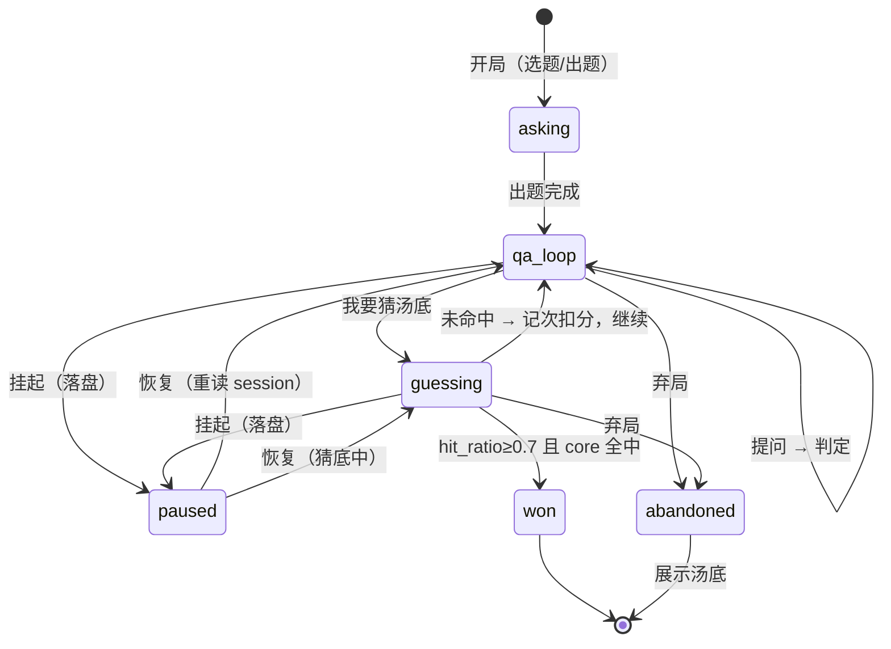

# 03 · 数据结构与持久化

> 一切设计围绕 Puzzle 与 Session 两个结构。玩法语义见 [01 游戏设计](01-游戏设计.md)，题源见 [04 题源与 ETL](04-题源与ETL.md)。

---

## 1. 题目（Puzzle）

```json
{
  "id": "classic-001",
  "title": "水与枪",
  "surface": "一个男人走进酒吧，向老板要了一杯水。老板突然拿出一把枪指着他。男人说了声谢谢就走了。为什么？",
  "truth": "男人在打嗝，要水是想喝水止嗝。老板看出来了，用枪吓他，受惊后打嗝停了，男人道谢离开。",
  "key_facts": [
    { "text": "男人正在打嗝", "core": true },
    { "text": "要水的目的是止嗝", "core": false },
    { "text": "老板识破了打嗝，用枪是吓唬而非威胁", "core": false },
    { "text": "受惊后打嗝停止", "core": true },
    { "text": "道谢是因为目的（止嗝）已达成", "core": false }
  ],
  "difficulty": 2,
  "tags": ["经典", "日常"],
  "source": "builtin",
  "created_at": 1759100000
}
```

**设计要点**：

- `key_facts` **4–6 条**（见 [01 §4.2](01-游戏设计.md)），每条独立可判定、语义自洽，合起来覆盖完整因果链。它是进度条、提示、胜负的**唯一锚点**——不靠 AI 主观打分。
- `key_facts[].core`：布尔，标记因果链的"因"与"果"，每题 1–2 条。**这是把"因果链完整"从主观判断变成客观条件的关键**（v1.0 无此字段，见 [01 §4.1](01-游戏设计.md)）。
- `truth` 允许写成完整段落，但要能拆解出 key_facts。
- `tags` 仅作**描述性标签**（`经典`/`日常`/`反转` 等）；血腥/色情内容在 ETL 阶段剔除，恐怖/灵异不过滤（见 [04 §4](04-题源与ETL.md)）。

---

## 2. 对局（Session）

```typescript
interface Session {
  id: string
  schemaVersion: number          // 见 §6
  puzzleId: string
  puzzleSnapshot?: {             // 见 §7 恢复兜底
    surface: string
    keyFactCount: number
    difficulty: number
  }
  messages: {
    role: 'player' | 'host'
    text: string
    judgment?: 'yes' | 'no' | 'irrelevant' | 'partial'  // host 专属
    hitFacts?: number[]                                  // 本条命中的 fact 序号
  }[]
  hitFacts: number[]             // 去重累积，驱动进度条
  questionCount: number
  hintsUsed: number              // L1 记 0.5，L2 记 1（见 01 §5）
  hintLevels: ('L1' | 'L2')[]    // 提示明细，供二期分析
  guessAttemptsFailed: number
  status: 'playing' | 'guessing' | 'paused' | 'won' | 'lost' | 'abandoned'
  startedAt: number
  endedAt?: number
}
```

- `status` 显式包含 `paused` 与 `guessing`，让挂起可发生在任意阶段（v1.0 状态机漏洞，见 §7）。
- 不冗余存 `truth`：恢复时 Rust 从题库现读；但同时存 `puzzleSnapshot` 以兜底题库变更。
- 落盘会话不包含 API Key 等敏感信息。

---

## 3. 存储选型：本地 JSON，不上数据库

**结论：不用 SQLite，零数据库依赖。** trade-off：

| 维度 | JSON 文件（选定） | SQLite |
|---|---|---|
| 数据规模 | 几十道题、几百局记录，KB 级 | 杀鸡用牛刀 |
| 依赖成本 | 零（serde 内建） | rusqlite 依赖 + 建表 + 迁移脚本 |
| 可编辑性 | 记事本直接改题库/看对局记录 | 需 DB 工具 |
| 备份迁移 | 复制目录即完成 | 单文件也易迁，但 schema 版本管理是负担 |
| 查询能力 | 全量载入后内存过滤 | SQL 随查 |

**升级触发条件**（满足任一，才引入 SQLite）：

1. 题库 > 200 道，且需要按 tags / 难度 / 来源组合筛选；
2. 战绩统计需跨全部历史做聚合分析（胜率曲线、题型弱项）；
3. 二期上云同步。

---

## 4. 文件布局

**配置文件 `config.json` 放工作目录根，理念同 `.env`**：本地私有、单文件、**允许内联 Key**、必进 `.gitignore`。
其余运行时数据放**项目根下的 `data/`**（便携、随仓库/二进制走，且已 `.gitignore`）。

```
<项目根>/                         # 开发期即仓库根；发行版为 exe 所在目录
├── config.json                   # 本地配置与密钥（.env 理念，已 gitignore）
├── assets/puzzles.json           # 出厂内置题库（只读，随包发布）

<项目根>/data/                    # 运行时数据（已 gitignore）
├── puzzles.json                  # 用户题库（拉取入库）
├── stats.json                    # 战绩记录（见 01 §9）
├── hidden.json                   # 已隐藏题目 id（"不再显示"，`/hide` 维护）
├── raw/                          # 数据集原始记录缓存（ETL 幂等重跑）
├── fetch_cursor.json             # 拉取游标（已消费的故事 id/offset）
├── logs/                         # 日志（见 07 §7）
└── sessions/                     # 每局一个 JSON，支撑挂起/恢复
```

> **目录机制（2026-10 改版）**：早期版本写到系统 app data（`%APPDATA%/turtle-soup/data`）；
> 现改为**项目根 `data/`**，首次运行自动把旧目录整体迁移过来（`lib.rs::migrate_legacy_app_data`）。

**`config.json` 查找顺序**（取第一个存在的）：`TURTLE_CONFIG` 环境变量 → 当前工作目录 → 项目根 → `data/`。
写入时也回写到同一位置。

**字段清单**：

`puzzles.json` —— 见 §1 结构。

`sessions/*.json`：

| 字段 | 类型 | 说明 |
|---|---|---|
| id | string | 对局唯一 id |
| schemaVersion | int | 结构版本，见 §6 |
| puzzle_id | string | 关联题——不冗余存 truth，恢复时现读 |
| puzzle_snapshot | object | 汤面 + 事实数 + 难度快照，题库变更时兜底 |
| messages | array | `{role, text, judgment?, hit_facts?}` |
| hit_facts | int[] | 累积命中序号（去重），驱动进度条 |
| question_count | int | 已问问题数 |
| hints_used | number | 提示折算值（L1=0.5, L2=1） |
| hint_levels | string[] | 提示级别明细 |
| guess_attempts_failed | int | 猜底失败次数 |
| status | enum | `playing / guessing / paused / won / lost / abandoned` |
| started_at / ended_at | int | 时间戳 |

`config.json`：`base_url / api_key / model / host_model`。
`api_key` 允许内联（个人单机自用，`.env` 同理念）；也可留空，改用环境变量（见 [07 §3](07-安全与异常.md)）。

`hidden.json`（独立小文件，schema v1；内置题库只读，隐藏状态单独记以便 `/unhide`）：

| 字段 | 类型 | 说明 |
|---|---|---|
| schemaVersion | int | 结构版本 |
| hidden_ids | string[] | 已隐藏的题目 id，随机选题时跳过 |

> 该文件为**新增独立存储**，不改动 `puzzles.json` / `sessions/*.json` / `stats.json` 的既有结构，
> 故**不递增全局 `SCHEMA_VERSION`**；其自身版本从 v1 起。

---

## 5. 写入原子性

所有 JSON 落盘采用"**写临时文件 → rename 覆盖**"，杜绝写一半崩溃导致文件损坏——玩到一半断电，对局文件必须还能读。

- 临时文件名带随机后缀（`session-xxx.json.tmp-{rand}`），避免并发冲突。
- Windows 上 `rename` 覆盖已存在文件需用 `ReplaceFile`/`MoveFileEx` 语义；直接 `std::fs::rename` 在目标存在时行为按平台确认，实现时用 `tempfile::persist` 或显式处理。
- 落盘失败不回滚内存状态，仅记日志 + UI 提示"存档失败"。

---

## 6. schema 版本与迁移（v1.0 缺失）

- 每个 JSON 文件带 `schemaVersion`（`puzzles.json` 顶层、`sessions/*.json` 顶层、`config.json` 顶层）。
- 启动时校验：低版本走迁移函数链（`v1→v2→…`），高版本（未来降级运行）拒绝加载并提示。
- 迁移函数写在 `session.rs`，纯函数、可单测；迁移前**自动备份**一份 `*.bak-{version}`。
- 新增字段默认值向后兼容；删除字段至少保留一个版本再清理。

---

## 7. 会话与题库变更的兜底（v1.0 缺失）

v1.0 让 session 只存 `puzzle_id`，而题库可被"拉取新题/单条删除"改动 → 恢复失败。

| 场景 | 处理 |
|---|---|
| 恢复时题目仍存在、且 key_facts 未变 | 正常恢复 |
| 恢复时题目仍存在、但 key_facts 条数/内容变了 | 用题目**当前**结构继续，但保留 `puzzleSnapshot.keyFactCount` 用于提示；命中序号按"当前索引"重算，越界忽略 |
| 恢复时题目已被删除 | 用 `puzzleSnapshot` 只能展示汤面、无法判定 → 提示"该题已从题库移除"，允许"查看历史记录"或"结束本局（不计分）" |
| 同时开新局 | 允许多个 `playing` 会话共存；启动时若有多个，列出让用户选；UI 大厅显示所有未完成局 |

---

## 8. 对局状态机



规则细节：

- **qa_loop** 中每条玩家输入 → 一次主持人调用 → 追加消息 + 合并 `hit_facts` → 更新进度条。
- **guessing**：玩家输入完整推理 → 一次猜底判定。命中（[01 §4.1](01-游戏设计.md)）→ `won`；否则失败反馈**只给条数与点评，不给未命中条目**（反泄底，[01 §4.3](01-游戏设计.md)），`guessAttemptsFailed++` 后回 qa_loop 继续（**猜底次数不设上限**，见 [01 §4.4](01-游戏设计.md)）。
- **提示**：`/hint` 单命令自动递进 L1/L2，次数不限（[01 §5](01-游戏设计.md)）。
- **挂起**：qa_loop 与 guessing 均可挂起，整个 Session 落盘；重开 App 后提示进行中对局。
- 弃局直接展示 `truth`；`lost` 保留为兼容状态，新对局不再产生。
